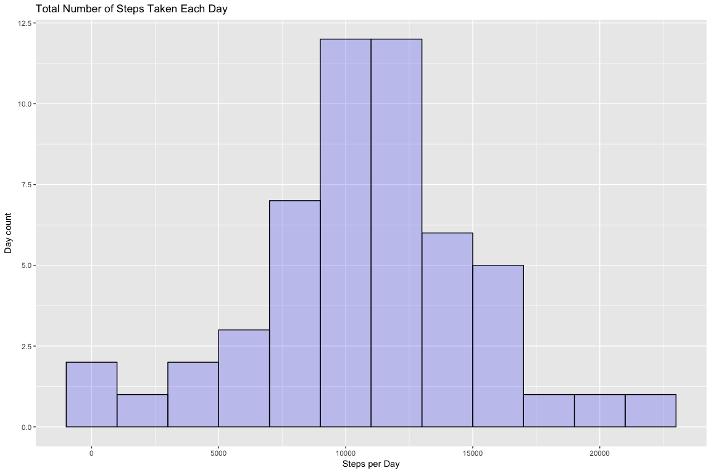
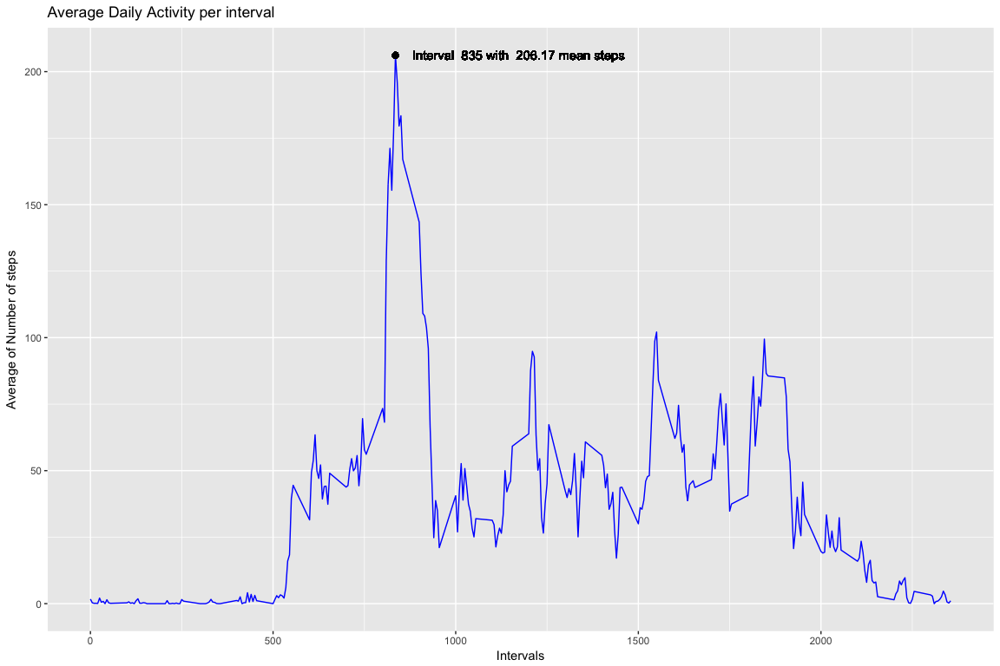
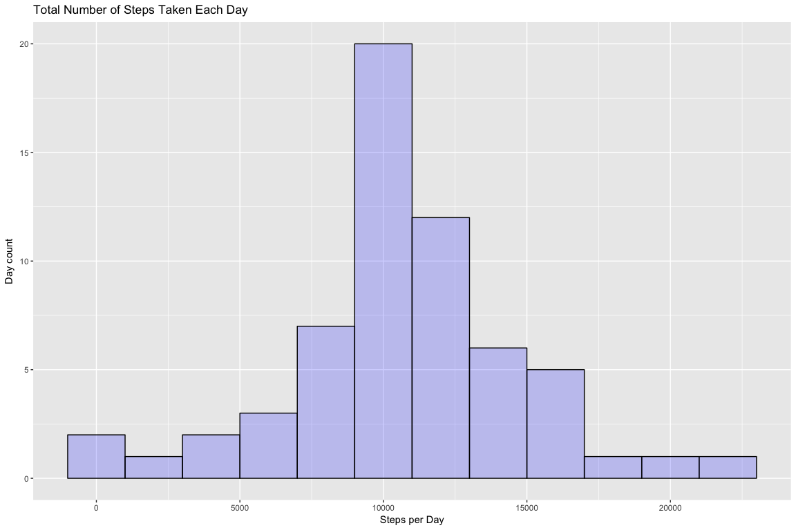
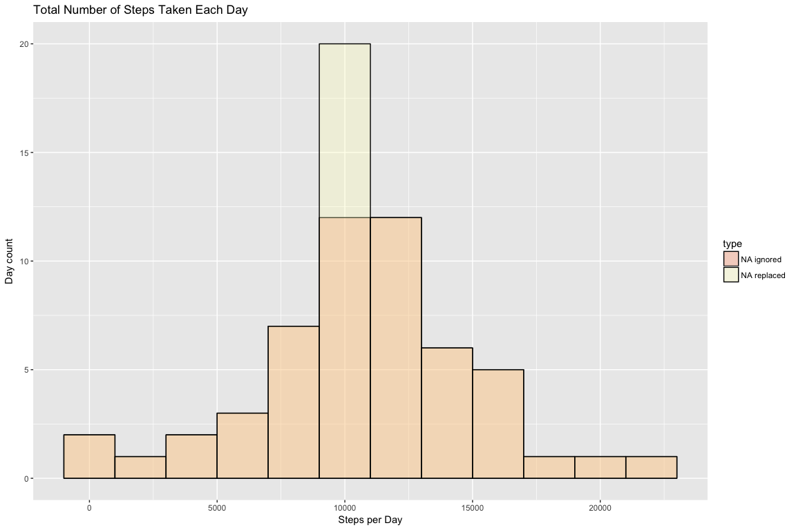
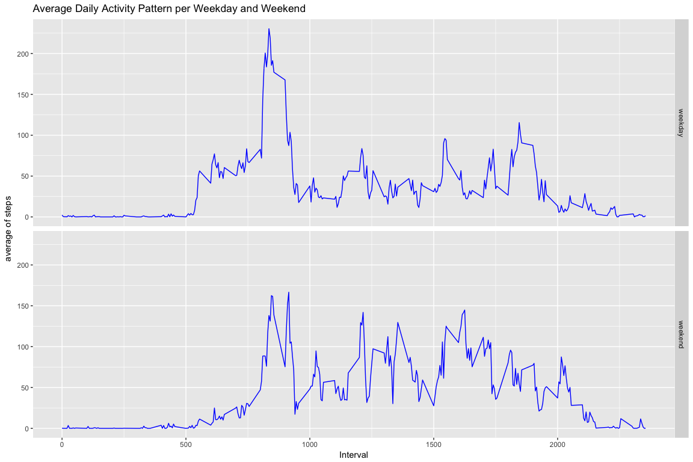

This assignment makes use of data from a personal activity monitoring device. This device collects data at 5 minute intervals through out the day. The data consists of two months of data from an anonymous individual collected during the months of October and November, 2012 and include the number of steps taken in 5 minute intervals each day.

## Setting general options and library

Setting general options


Uploading necessary library for R script

```r
library(lubridate)
library(dplyr)
library(ggplot2)
Sys.setlocale(locale="en_US")
```

```
## [1] "en_US/en_US/en_US/C/en_US/it_IT.UTF-8"
```

## Loading and preprocessing the data

Uploading dataset - Setting path, dowload files, unzip

```r
# Setting path
fileurl <-"https://d396qusza40orc.cloudfront.net/repdata%2Fdata%2Factivity.zip"
filezip <- "activity.zip"
fileName <- "activity.cvs"

#download zip file
if(!file.exists(fileName)) {
  download.file(fileurl, filezip)
  #unzip file
  unzip(zipfile = filezip) }
```

Creating dataframe from data file and converting the date variable to the date format in R.

```r
mydata <- read.csv("activity.csv")
mydata$date <- as.Date(mydata$date, "%Y-%m-%d")
```

## 1. What is mean total number of steps taken per day?

NOTE: For this part of the assignment, the missing values in the dataset have been ignored.

### 1.1 Calculate the total number of steps taken per day

```r
mydata_no_na <- subset(mydata, !is.na(mydata$steps)) # Dropping NA
# Grouping and summarize per date
mydata_steps_day <- mydata_no_na %>% group_by(date) %>% summarize(sum(steps))
names(mydata_steps_day) <- c("date", "steps") #review col names
head(mydata_steps_day,3)
```

```
## # A tibble: 3 x 2
##   date       steps
##   <date>     <int>
## 1 2012-10-02   126
## 2 2012-10-03 11352
## 3 2012-10-04 12116
```

### 1.2 Make a histogram of the total number of steps taken each day

```r
qplot(mydata_steps_day$steps, geom="histogram", binwidth = 2000,
      main = "Total Number of Steps Taken Each Day", 
      xlab = "Steps per Day", ylab= "Day count", fill=I("blue"), col=I("black"), alpha=I(.2))
```

<!-- -->

### 1.3 Calculate the mean and median of the total number of steps taken per day

```r
summary(mydata_steps_day$steps)
```

```
##    Min. 1st Qu.  Median    Mean 3rd Qu.    Max. 
##      41    8841   10765   10766   13294   21194
```


The mean and median of the total number of steps taken per day are:

* mean:   10766

* median: 10765

## 2. What is the average daily activity pattern?
### 2.1 Make a time series plot of the 5-minute interval and the average number of steps taken, averaged across all days

Evaluation of time series per interval and showing head of dataframe

```r
mydata_timeseries <- mydata_no_na %>% group_by(interval) %>% summarize(mean(steps))
colnames(mydata_timeseries) <- c("interval", "mean_steps")
head(mydata_timeseries,3)
```

```
## # A tibble: 3 x 2
##   interval mean_steps
##      <int>      <dbl>
## 1        0      1.72 
## 2        5      0.340
## 3       10      0.132
```


### 2.2 Which 5-minute interval, on average across all the days in the dataset, contains the maximum number of steps?
Plotting the time series

```r
ggplot(mydata_timeseries, aes(x = interval, y=mean_steps)) +
    labs(title = "Average Daily Activity per interval", 
         x = "Intervals", y = "Average of Number of steps") +
    geom_line(color="blue", size= .5) +
    geom_text(aes(x = 835, y = 206.1698), label= plt_str, hjust = -0.08) +
    geom_point(data=mydata_timeseries, aes(x = x_max, y = y_max),
               color = "black", size = 2, show.legend = TRUE)
```

<!-- -->

## 3. Imputing missing values
### 3.1 Calculate and report the total number of missing values in the dataset
The total number of rows with NA value are:

```r
sum(rowSums(is.na(mydata)))
```

```
## [1] 2304
```

### 3.2 Devise a strategy for filling in all of the missing values in the dataset.
The strategy for filling all missing value is based on replace NA value with the mean of the corresponding interval

```r
# re-start from original data
mydata_na <- is.na(mydata$steps) #list of NA value in mydata (the origianl dataset)
# evaluation of mean per interval
meanvalue <- tapply(mydata$steps, mydata$interval, mean, na.rm=TRUE, simplify=TRUE)
head(meanvalue)
```

```
##         0         5        10        15        20        25 
## 1.7169811 0.3396226 0.1320755 0.1509434 0.0754717 2.0943396
```

### 3.3 Create a new dataset that is equal to the original dataset but with the missing data filled in.
Creation of dataset with filled mean at NA value and checking for cleaness

```r
mydata$steps[mydata_na] <- meanvalue[as.character(mydata$interval[mydata_na])]
sum(is.na(mydata$steps)) # checking for NA value
```

```
## [1] 0
```

### 3.4 Make a histogram of the total number of steps taken each day and Calculate and report the mean and median total number of steps taken per day. 
Creation of dataframe grouped per date with total steps

```r
mydataok_steps_day <- mydata %>% group_by(date) %>% summarize(sum(steps))
names(mydataok_steps_day) <- c("date", "steps") #review col names
head(mydataok_steps_day,3)
```

```
## # A tibble: 3 x 2
##   date        steps
##   <date>      <dbl>
## 1 2012-10-01 10766.
## 2 2012-10-02   126.
## 3 2012-10-03 11352.
```

Plotting the histogram

```r
qplot(mydataok_steps_day$steps, geom="histogram", binwidth = 2000,
      main = "Total Number of Steps Taken Each Day", 
      xlab = "Steps per Day", ylab= "Day count", fill=I("blue"), col=I("black"), alpha=I(.2))
```

<!-- -->

### 3.5 Are there differences in activity patterns between weekdays and weekends?
Create of a grouped per day dataframe with NA and filled data

```r
#Adding type column for datasets merging
mydata_steps_day$type <- "NA ignored"       #dataset grouped by date without NA
mydataok_steps_day$type <- "NA replaced"    #dataset grouped with NA replaced
mydata_steps_mrg <- rbind(mydataok_steps_day,mydata_steps_day) #joining together
head(mydata_steps_mrg,3)
```

```
## # A tibble: 3 x 3
##   date        steps type       
##   <date>      <dbl> <chr>      
## 1 2012-10-01 10766. NA replaced
## 2 2012-10-02   126. NA replaced
## 3 2012-10-03 11352. NA replaced
```

```r
table(mydata_steps_mrg$type)
```

```
## 
##  NA ignored NA replaced 
##          53          61
```

Plotting...

```r
ggplot(data = mydata_steps_mrg, aes(steps, fill = type))+ 
    scale_fill_brewer(palette="Spectral") +
    geom_histogram(alpha = .3, aes(y = ..count..),
                 col = "black", position = 'identity', binwidth = 2000) +
    labs(title = "Total Number of Steps Taken Each Day", 
         x = "Steps per Day", y = "Day count")
```

<!-- -->

There is difference between the two datasets due to the replacement of NA value

## 4. Are there differences in activity patterns between weekdays and weekends?
### 4.1 Create a new factor variable in the dataset with two levels - "weekday" and "weekend" indicating whether a given date is a weekday or weekend day.
Update dataset with a new variable "daywk" which contians the type of day (weekday or weekend)

```r
mydata$daywk <- ifelse(wday(mydata$date) == 1 | wday(mydata$date) == 7, "weekend", "weekday") ## new variable
head(mydata) #show new dataframe
```

```
##       steps       date interval   daywk
## 1 1.7169811 2012-10-01        0 weekday
## 2 0.3396226 2012-10-01        5 weekday
## 3 0.1320755 2012-10-01       10 weekday
## 4 0.1509434 2012-10-01       15 weekday
## 5 0.0754717 2012-10-01       20 weekday
## 6 2.0943396 2012-10-01       25 weekday
```

```r
table(mydata$daywk) #show table
```

```
## 
## weekday weekend 
##   12960    4608
```

### 4.2 Make a panel plot containing a time series plot of the 5-minute interval (x-axis) and the average number of steps taken, averaged across all weekday days or weekend days (y-axis). 

Creation of time series grouping per interval and type of day (daywk)

```r
#Grouping per interval and daywk
mydata_timeseries_wk <- mydata %>% group_by(interval, daywk) %>% summarize(mean(steps))
colnames(mydata_timeseries_wk) <- c("interval" ,"daywk","steps") #Renaming columsn
```

Plotting...

```r
ggplot(mydata_timeseries_wk, aes(interval,steps)) +
    geom_line(color="blue", size= .5) +
    facet_grid(daywk ~.) +
    labs(title = "Average Daily Activity Pattern per Weekday and Weekend", 
         x = "Interval", y = "average of steps") 
```

<!-- -->

There are differences in activity patterns between weekdays and weekends. It seems that on first part of the day, during weekend, the person is less active than on weekday
